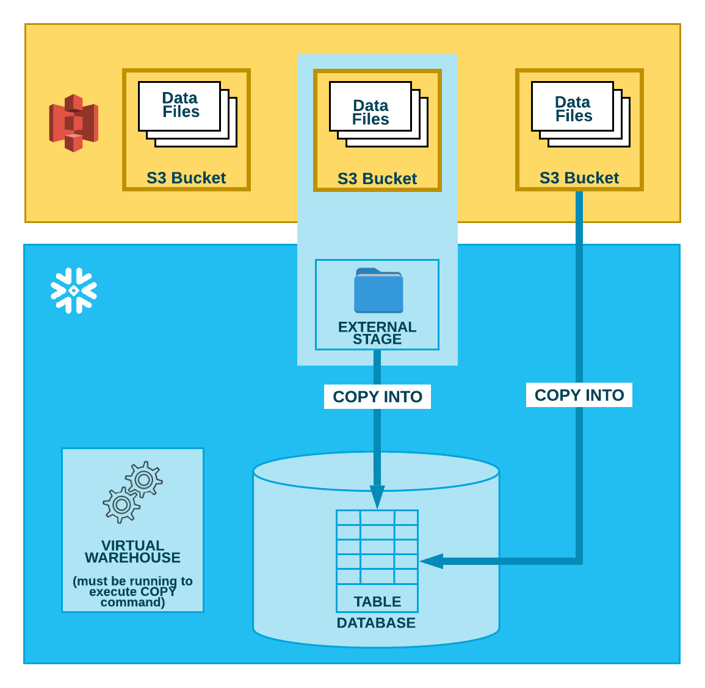

# Zero-ETL with Amazon S3 and Snowflake via Storage Integration - powered by CDK

This blog post represents the first part of a series of blog posts presenting the idea of introducing a modern data platform with and on AWS. In addition to AWS, MRH Trowe uses Matillion, Snowflake DataHub Project and PowerBI. There will be technical parts and more doctrinal considerations that discuss concepts. Wherever it makes sense, code examples and CDK projects are also used.

## TDLR;

With Snowflake Storage Integration, Amazon S3 can be used as an external stage. This offers various advantages, such as the fulfillment of compliance requirements or the integration of a metadata catalog. With the CDK, the deployment of Storage Integration can be scaled to achieve high configuration standards and a zero-ETL architecture can be built.

## The Concept of Zero-ETL

During Reinvent 2023, [AWS](https://aws.amazon.com/what-is/zero-etl/?nc1=h_ls) presented some Zero-ETL features. But what is zero-ETL and what can it help us with, and where does work still need to be invested?

> Zero-ETL is a set of integrations that eliminates or minimizes the need to build ETL data pipelines. Extract, transform, and load (ETL) is the process of combining, cleaning, and normalizing data from different sources to get it ready for analytics, artificial intelligence (AI) and machine learning (ML) workloads. Traditional ETL processes are time-consuming and complex to develop, maintain, and scale. Instead, zero-ETL integrations facilitate point-to-point data movement without the need to create ETL data pipelines. Zero-ETL can also enable querying across data silos without the need for data movement.

From my experience there is a great preference for zero-ETL for systems that have either very simple data structures. For example, log files. Or for systems that already export highly aggregated data points. Everything in between still needs to be worked through.

However, the concept of zero-ETL has been around for longer than 2023 and is also available outside of AWS. When the last two suppliers decided on Snowflake, the storage integration feature was a significant advantage of this platform.

## The Magic behind the Scenes: Integrating Amazon S3 and Snowflake

Loading data from S3 to [Snowflake](https://docs.snowflake.com/en/user-guide/data-load-s3) works similarly to the zero-ETL feature from S3 to OpenSearch or Redshift. For this to work, Snowflake provides an IAM user when you first order in a Snowflake account. We create an IAM role in our account for this user, which is allowed to access the entire bucket or only parts of it. In addition, an [encryption](https://docs.snowflake.com/en/user-guide/security-encryption-end-to-end) can be created for the bucket, which can also be used by the IAM policy of the IAM role. The Snowflake IAM user and an external id are now referenced in the trust policy. This game together allows secure communication.

If you're just thinking about network integration, you'll find this note in the Snowflake documentation:

> Snowflake uses Amazon S3 Gateway Endpoints in each of its Amazon Virtual Private Clouds. If the S3 bucket referenced by your external stage is in the same region as your Snowflake account, your network traffic does not traverse the public Internet. The Amazon S3 Gateway Endpoints ensure that regional traffic stays within the AWS network.

This means that the Snowflake network segment is not under the customer's control but is integrated into the AWS S3 backbone. 

For the data to be used in Snowflake, [external](https://docs.snowflake.com/en/user-guide/tables-external-intro) or [internal](https://docs.snowflake.com/en/user-guide/data-load-s3-copy) tables must be created, which in turn are filled using COPY INTO. This requires, among other things, information about the file type or the encoding.



In addition to the use of an external stage, the picture also shows the direct integration of S3. This has one major disadvantage: it does not track the existing files that are already in S3 when new data is written. However, this is the case with the External Stage. Snowflake checks the FILE PATH and ETAG value of the file to decide on whether it will load the file or skip it. If any of the parameters ETAG value or FILE PATH is changed Snowflake will load the file assuming it's a new file. If you are interested in this feature, you can find multiple scenarios within this [blog post](https://community.snowflake.com/s/article/Duplicate-files-getting-loaded-in-Snowflake-from-external-AWS-buckets-OR-Azure-containers). 

In summary: Storage integration enables a very granular authorization system. Here, management credentials are not necessary. Due to the definition of an IAM policy, an external stage can only be used for reading purposes. Ultimately, the AWS infrastructure can be used for various external stages.

## CDK Implementation: Storage Integrations at Scale

To build the AWS implementation, a storage integration snowflake must first be deployed. To build the AWS implementation, a storage integration snowflake must first be deployed. It doesn't matter whether the AWS IAM role already exists. It is helpful to use self-defined names for the AWS resources and not the CDK-based names.

```SQL
create storage integration "storage-integration-source-system"
    type = external_stage
    storage_provider = s3
    storage_aws_role_arn = 'arn:aws:iam::101112131415:role/snowflake-storage-integration-source-system'
    enabled = true
    storage_allowed_locations = ( 's3://mrht-snowflake-storage-integration-source-system');
```

The next command will give you the external id and the Snowflake IAM user ARN.

```SQL
DESC INTEGRATION "storage-integration-source-system";
```

This means we have all the information for creating the S3 bucket as well as the KMS key and the IAM role. 

```Python
# zero_Etl_stack.py
from aws_cdk import (
    Stack,
    aws_s3 as s3,
    aws_kms as kms,
    aws_iam as iam,
    RemovalPolicy,
)
from constructs import Construct

class SnowflakeStorageIntegration(Stack):
    """Create the actual deployment in each AWS account.

    Args:
        Stage (Stage): cdk Class stage
    """

    def __init__(
        self, scope: Construct, construct_id: str, **kwargs
    ) -> None:
        """Initialise CDK stack class."""
        super().__init__(scope, construct_id, **kwargs)
        """Create the actual CloudFormation stack."""

        self.sf_iam_user_arn = "arn:aws:iam::012345678910:user/sf-users"
        self.buckets = []

        storage_integrations = [
            {
                "SourceSystem": "source-system",
                "SnowflakeExternalID": "AB123456_SFCRole=FOO_BAR=",
                "SnowflakeUserArn": self.sf_iam_user_arn,
            }
        ]

        for i in storage_integrations:
            self.storage_integration(
                source_name=i["SourceSystem"],
                snowflake_external_id=i["SnowflakeExternalID"],
                snowflake_user_arn=i["SnowflakeUserArn"],
            )

    def storage_integration(
        self,
        source_name: str,
        snowflake_external_id: str,
        snowflake_user_arn: str,
    ):
        """Create an AWS ensemble for a specific Snowflake Storage Integration.

        Args:
            source_name (str): name of the source system
            snowflake_external_id (str): external id generated by Snowflake
            snowflake_user_arn (str): Snowflake User Arn
        """
        bucket_key = kms.Key(
            self,
            id=f"BucketKey{source_name}",
            description=f"This key is used for encrypting contents of bucket snowflake-storage-integration-{source_name}",
            enabled=True,
            enable_key_rotation=True,
            alias=f"BucketKey/{source_name}",
            removal_policy=RemovalPolicy.RETAIN,
        )

        storage_bucket = s3.Bucket(
            self,
            id=f"StorageBucket{source_name}",
            enforce_ssl=True,
            encryption_key=bucket_key,
            bucket_key_enabled=True,
            block_public_access=s3.BlockPublicAccess.BLOCK_ALL,
            removal_policy=RemovalPolicy.RETAIN,
            versioned=True,
            bucket_name=f"snowflake-storage-integration-{source_name}"
        )

        sf_iam_role = iam.Role(
            self,
            id=f"StorageIntegrationRole{source_name}",
            assumed_by=iam.ArnPrincipal(arn=snowflake_user_arn),
            external_ids=[snowflake_external_id],
            role_name=f"snowflake-storage-integration-{source_name}"
        )

        storage_bucket.grant_read(sf_iam_role)
```

The Snowflake IAM User ARN will always be the same, while the external ID changes from Storage Integration to Storage Integration. Whit that we can first create the Snowflake Storage Integration via SQL and append afterwards the array `storage_integrations` to create the AWS infrastructure at scale.

## Lessons Learned from the Daily Work

I would also like to share a few experiences in the article about dealing with Storage integration. An important decision for any ETL pipeline is how to handle storage integration updates. This doesn't happen automatically. There are options here to control this completely synchronously (via [ALTER STAGE](https://docs.snowflake.com/en/sql-reference/sql/alter-stage) command) or to make it synchronous using an event channel (namely via [Amazon SQS](https://docs.snowflake.com/en/sql-reference/sql/create-stage#external-stage-parameters-for-amazon-s3-compatible-storage-externalstageparams)). In my organization we usually have a few files and the ETL pipelines only run once a day, which is why we choose the synchronous route via ALTER STAGE. From my point of view, the asynchronous method is suitable if you process a lot of files and process them several times a day.

Especially when you start new projects, changes in the data schema can occur regularly because new requirements require new fields. The [schema evolution](https://docs.snowflake.com/en/user-guide/data-load-schema-evolution#examples) feature can help here. Conversely, if the feature is not activated when a table is created, major problems will occur when editing the table. In my opinion it should always be used when creating new tables.

With the external stage feature we have the data primarily in S3. Snowflake also offers the option of using external tables. Here, the Snowflake data warehouse only sees the data at query runtime. In contrast, internal tables store the data in the data warehouse. My things on this: Firstly, you lose a lot of features when you use external tables. Secondly, you gain latency, which does not affect the user experience when the data is small. If the data is large, the processing time increases accordingly. In addition to these things, S3 may also incur increased transfer costs. So, unless it's necessary, I wouldn't use external tables now, unless I need to implement very compliance standards.

## Summary

In summary, with Storage integration between Snowflake and S3 we can build a simple zero-ETL architecture and have full flexibility to build granularity on both the AWS and Snowflake sides. From our perspective, even very high compliance requirements can be achieved with encryption, an IAM system, network integration and the location of data storage.
